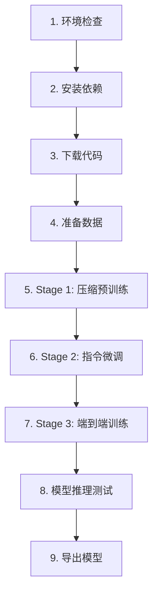

# CLaRa Colab Training Guide

完整的 Google Colab 训练教程 - 使用合成数据在云端训练 CLaRa 模型

---

## 📖 目录

- [快速开始](#快速开始)
- [硬件要求](#硬件要求)
- [训练流程](#训练流程)
- [数据准备](#数据准备)
- [分阶段训练](#分阶段训练)
- [常见问题](#常见问题)
- [性能优化](#性能优化)

---

## 🚀 快速开始

### 1. 打开 Notebook

将 `training_colab_complete.ipynb` 上传到 Google Colab：

**方法 A：直接上传**
1. 访问 [Google Colab](https://colab.research.google.com)
2. 点击 "文件" → "上传笔记本"
3. 选择 `training_colab_complete.ipynb`

**方法 B：通过 GitHub**
1. 将 notebook 推送到 GitHub
2. 在 Colab 中选择 "GitHub" 标签
3. 输入仓库 URL 并加载

### 2. 配置运行时

**重要：必须使用 GPU 运行时**

1. 点击 "运行时" → "更改运行时类型"
2. 硬件加速器：选择 **GPU**（T4、V100 或 A100）
3. 运行时配置：选择 **High-RAM**（推荐）
4. 点击 "保存"

### 3. 依次执行

按顺序执行所有单元格：
- 点击 "运行时" → "全部运行"
- 或按 `Ctrl+F9` / `Cmd+F9`

**预计总时间：**
- T4 GPU：1-2 小时
- V100 GPU：45-90 分钟
- A100 GPU：30-60 分钟

---

## 💻 硬件要求

### GPU 配置对比

| GPU 型号 | 显存 | 训练速度 | 批次大小 | Colab 可用性 |
|---------|------|---------|---------|------------|
| T4 | 16GB | 基准 (1x) | 小 (32) | ✅ 免费版 |
| V100 | 16/32GB | 快 (2x) | 中 (64) | 💰 Pro |
| A100 | 40/80GB | 很快 (4x) | 大 (128) | 💰 Pro+ |

### 推荐配置

**快速测试**（免费）
- GPU: T4
- RAM: 标准 (12GB)
- 训练样本数: 200-500
- 用途: 测试流程、验证数据

**正式训练**（Pro）
- GPU: V100 或 A100
- RAM: High-RAM (25GB)
- 训练样本数: 1000+
- 用途: 完整训练、生产模型

---

## 📊 训练流程

### 完整流程图



### 各阶段详情

#### Stage 1: 压缩预训练 (Compression Pretraining)

**目标：** 训练压缩器，将文档压缩为连续潜在表示

**输入数据格式：** `pretrain_data.jsonl`
```json
{
  "data_type": "qa",
  "question": ["问题文本"],
  "answers": ["答案文本"],
  "docs": ["文档内容"]
}
```

**关键参数：**
- `--stage stage1`
- `--compress_rate 32`（32倍压缩）
- `--qa_loss`（QA 损失）
- `--mse_loss`（MSE 损失）

**输出：** `/content/checkpoints/clara_stage1/`

#### Stage 2: 指令微调 (Instruction Tuning)

**目标：** 在下游 QA 任务上微调压缩器

**输入数据格式：** `instruction_data.jsonl`
```json
{
  "question": "问题文本",
  "docs": ["文档1", "文档2"],
  "gold_answer": "参考答案"
}
```

**关键参数：**
- `--stage stage2`
- `--ckpt_path` 指向 Stage 1 检查点

**输出：** `/content/checkpoints/clara_stage2/`

#### Stage 3: 端到端训练 (End-to-End Training)

**目标：** 联合训练重排序器和生成器

**输入数据格式：** `end_to_end_data.jsonl`（与 Stage 2 相同）

**关键参数：**
- `--stage stage3`
- `--generation_top_k 5`（top-k 检索）
- `--ckpt_path` 指向 Stage 2 检查点

**输出：** `/content/checkpoints/clara_stage3_final/` （最终模型）

---

## 📁 数据准备

### 选项 1：使用示例数据（推荐用于首次运行）

Notebook 已包含示例数据：
- `example/pretrain_data.jsonl` - 预训练数据
- `example/instruction_data.jsonl` - 指令数据
- `example/end_to_end_data.jsonl` - 端到端数据

**优点：** 无需准备，直接训练
**缺点：** 数据量小，仅供测试

### 选项 2：使用自己的合成数据

**步骤 1：本地生成数据**

使用项目的数据管道生成训练数据：

```bash
# 在本地执行
export RAW_DATA_DIR="./raw_data"
export OPENAI_API_KEY="your-api-key"
bash scripts/run_data_pipeline.sh
```

生成的文件：
- `example/clara_training_data.jsonl` - 包含所有数据

**步骤 2：分割数据**

```python
# split_data.py
import json

with open('example/clara_training_data.jsonl', 'r') as f:
    all_data = [json.loads(line) for line in f]

# 分割数据
pretrain_data = all_data[:len(all_data)//2]
instruction_data = all_data[len(all_data)//2:]
end_to_end_data = instruction_data

# 保存
with open('pretrain_data.jsonl', 'w') as f:
    for item in pretrain_data:
        f.write(json.dumps(item, ensure_ascii=False) + '\n')

with open('instruction_data.jsonl', 'w') as f:
    for item in instruction_data:
        f.write(json.dumps(item, ensure_ascii=False) + '\n')

with open('end_to_end_data.jsonl', 'w') as f:
    for item in end_to_end_data:
        f.write(json.dumps(item, ensure_ascii=False) + '\n')
```

**步骤 3：上传到 Colab**

在 notebook 的数据准备部分，取消注释上传代码：

```python
from google.colab import files
uploaded = files.upload()  # 选择你的 .jsonl 文件
```

### 数据质量要求

**每个阶段最少数据量：**
- Stage 1: 100+ QA 对
- Stage 2: 50+ 问答对
- Stage 3: 50+ 问答对

**推荐数据量：**
- 小规模测试: 200-500 样本
- 中等规模: 1,000-5,000 样本
- 大规模训练: 10,000+ 样本

---

## ⚙️ 训练配置

### 自动配置

Notebook 会根据 GPU 内存自动调整参数：

```python
# T4 (16GB)
TRAIN_BATCH_SIZE = 32
MICRO_BATCH_SIZE = 1
MAX_SAMPLES = 200

# V100/A100-40GB
TRAIN_BATCH_SIZE = 64
MICRO_BATCH_SIZE = 2
MAX_SAMPLES = 500

# A100-80GB
TRAIN_BATCH_SIZE = 128
MICRO_BATCH_SIZE = 2
MAX_SAMPLES = 1000
```

### 手动调整

如果遇到 OOM（内存不足），在配置单元格中修改：

```python
# 减小批次大小
TRAIN_BATCH_SIZE = 16  # 从 32 减小
MICRO_BATCH_SIZE = 1   # 保持最小

# 减少训练样本
MAX_SAMPLES = 100  # 从 200 减小

# 减小序列长度
MAX_LEN = 1024  # 从 2048 减小
```

### 其他重要参数

```python
# 学习率
LEARNING_RATE = 1e-4  # 默认值，可调整为 5e-5 或 2e-4

# 压缩率
COMPRESS_RATE = 32  # 可选: 16, 32, 64

# 文档最大长度
DOC_MAX_LENGTH = 256  # 根据文档长度调整
```

---

## 🔧 常见问题

### Q1: 运行时断开连接

**问题：** Colab 空闲 90 分钟后断开

**解决方案：**
1. **使用 Colab Pro**：更长的运行时间
2. **定期交互**：每小时点击一次页面
3. **保存检查点**：
```python
# 在训练脚本中添加
--save_steps 50  # 每 50 步保存
```

### Q2: Out of Memory (OOM)

**错误信息：** `CUDA out of memory`

**解决方案：**
```python
# 1. 减小批次大小
TRAIN_BATCH_SIZE = 16
MICRO_BATCH_SIZE = 1

# 2. 减少最大样本数
MAX_SAMPLES = 100

# 3. 启用梯度检查点（已默认启用）
--gradient_checkpointing

# 4. 减小序列长度
MAX_LEN = 1024
```

### Q3: 训练速度太慢

**优化方法：**

1. **安装 Flash Attention**
```python
# 在依赖安装部分取消注释
!pip install flash-attn --no-build-isolation
USE_FLASH_ATTN = True
```

2. **使用更快的 GPU**
- 升级到 Colab Pro
- 选择 V100 或 A100

3. **减少数据量**
```python
MAX_SAMPLES = 200  # 用于测试
```

### Q4: 检查点加载失败

**错误：** `FileNotFoundError` 或 `Checkpoint not found`

**检查：**
```bash
# 验证检查点存在
!ls -lh /content/checkpoints/clara_stage1/

# 检查磁盘空间
!df -h
```

**解决：**
- 确保上一阶段训练完成
- 检查是否有足够磁盘空间（需要 20-30GB）

### Q5: Flash Attention 安装失败

**问题：** 编译错误或超时

**解决方案：**
```python
# 跳过 flash-attn，使用标准 attention
USE_FLASH_ATTN = False
FLASH_ATTN_FLAG = ''

# 训练仍可正常进行，速度略慢 10-15%
```

### Q6: 数据格式错误

**错误：** `JSONDecodeError` 或 `KeyError`

**检查数据格式：**
```python
import json

# 验证 JSONL 文件
with open('pretrain_data.jsonl', 'r') as f:
    for i, line in enumerate(f):
        try:
            data = json.loads(line)
            print(f"Line {i}: {list(data.keys())}")
        except Exception as e:
            print(f"Error at line {i}: {e}")
            break
```

**标准格式：**
- Stage 1: `data_type`, `question`, `answers`, `docs`
- Stage 2/3: `question`, `docs`, `gold_answer`

---

## 🚀 性能优化

### 加速训练的方法

#### 1. Flash Attention（推荐）

**加速：** 10-15%
**安装：**
```bash
pip install flash-attn --no-build-isolation
```

#### 2. 使用更快的 GPU

| GPU | 相对速度 | 价格 |
|-----|---------|------|
| T4 | 1x | 免费 |
| V100 | 2x | Pro |
| A100-40GB | 3x | Pro+ |
| A100-80GB | 4x | Pro+ |

#### 3. 批次大小优化

```python
# 找到最大可用批次大小
for batch_size in [32, 64, 96, 128]:
    try:
        TRAIN_BATCH_SIZE = batch_size
        # 运行训练...
        print(f"Success with batch_size={batch_size}")
        break
    except RuntimeError as e:
        if "out of memory" in str(e):
            continue
```

#### 4. 混合精度训练

```bash
# 已默认启用 bfloat16
--bf16

# 如果 GPU 不支持，使用 float16
--fp16
```

### 成本优化

#### 免费版 Colab

**限制：**
- T4 GPU
- 12 小时运行时
- 可能排队等待

**适用于：**
- 测试流程
- 小规模数据（<500 样本）
- 学习和实验

#### Colab Pro ($10/月)

**优势：**
- V100 或 A100 GPU
- 24 小时运行时
- 优先访问
- 更多 RAM

**适用于：**
- 正式训练
- 中大规模数据（1000+ 样本）
- 生产模型

#### 计算单元估算

**免费版：**
- Stage 1: 30-60 分钟
- Stage 2: 30-60 分钟
- Stage 3: 45-90 分钟
- **总计：** 2-3 小时

**Pro (A100):**
- Stage 1: 10-20 分钟
- Stage 2: 10-20 分钟
- Stage 3: 15-30 分钟
- **总计：** 40-70 分钟

---

## 📤 模型导出

### 方法 1：下载到本地

```python
# 创建压缩包
!cd /content/checkpoints && \
  zip -r clara_final.zip clara_stage3_final/

# 下载
from google.colab import files
files.download('/content/checkpoints/clara_final.zip')
```

**文件大小：** ~14GB（Mistral-7B）

### 方法 2：保存到 Google Drive

```python
# 挂载 Drive
from google.colab import drive
drive.mount('/content/drive')

# 复制模型
!cp -r /content/checkpoints/clara_stage3_final \
  /content/drive/MyDrive/CLaRa_Models/

print('✅ Model saved to Google Drive')
```

### 方法 3：上传到 HuggingFace Hub

```python
# 安装 huggingface_hub
!pip install huggingface_hub

# 登录
from huggingface_hub import login
login()  # 输入你的 token

# 上传模型
from huggingface_hub import HfApi
api = HfApi()

api.upload_folder(
    folder_path="/content/checkpoints/clara_stage3_final",
    repo_id="your-username/clara-custom",
    repo_type="model"
)
```

---

## 🧪 模型测试

### 快速推理测试

```python
from transformers import AutoTokenizer, AutoModelForCausalLM
import torch

# 加载模型
model_path = "/content/checkpoints/clara_stage3_final"
tokenizer = AutoTokenizer.from_pretrained(model_path)
model = AutoModelForCausalLM.from_pretrained(
    model_path,
    torch_dtype=torch.bfloat16,
    device_map="auto"
)

# 测试问答
def test_qa(question, document):
    prompt = f"Document: {document}\n\nQuestion: {question}\n\nAnswer:"
    inputs = tokenizer(prompt, return_tensors="pt").to(model.device)

    outputs = model.generate(
        **inputs,
        max_new_tokens=100,
        temperature=0.7,
        do_sample=True
    )

    return tokenizer.decode(outputs[0], skip_special_tokens=True)

# 测试
question = "What is CLaRa?"
document = "CLaRa is a framework for retrieval-augmented generation..."
answer = test_qa(question, document)
print(answer)
```

### 批量评估

```python
# 准备测试集
test_data = [
    {"question": "Q1", "doc": "Doc1", "expected": "A1"},
    {"question": "Q2", "doc": "Doc2", "expected": "A2"},
]

# 评估
results = []
for item in test_data:
    pred = test_qa(item["question"], item["doc"])
    results.append({
        "question": item["question"],
        "expected": item["expected"],
        "predicted": pred
    })

# 显示结果
import pandas as pd
df = pd.DataFrame(results)
print(df)
```

---

## 📚 高级使用

### 自定义训练参数

编辑配置单元格，修改训练参数：

```python
# 训练轮数
MAX_EPOCHS = 3  # 增加到 3 轮

# 学习率衰减
LEARNING_RATE = 2e-4  # 调整学习率
LR_SCHEDULER = 'cosine'  # 添加学习率调度

# 压缩率实验
COMPRESS_RATE = 64  # 尝试 64 倍压缩

# 更频繁的保存
SAVE_STEPS = 50  # 每 50 步保存一次

# 启用 WandB 日志
USE_WANDB = True
WANDB_PROJECT = "clara-training"
```

### 断点续训

如果训练中断，可以从检查点继续：

```python
# 恢复 Stage 1
!torchrun ... \
    --ckpt_path /content/checkpoints/clara_stage1 \
    --resume_training

# 或手动指定 step
--resume_from_checkpoint /path/to/checkpoint-100
```

### 多 GPU 训练

虽然 Colab 通常只有单 GPU，但代码支持多 GPU：

```python
# 检测 GPU 数量
NUM_GPUS = torch.cuda.device_count()
print(f"Available GPUs: {NUM_GPUS}")

# 自动使用所有 GPU
!torchrun --nproc_per_node={NUM_GPUS} ...
```

---

## 🔗 相关资源

### 文档
- [README.md](README.md) - 项目主文档
- [DATA_PIPELINE_GUIDE.md](DATA_PIPELINE_GUIDE.md) - 数据处理指南
- [FLASH_ATTN_FIX.md](FLASH_ATTN_FIX.md) - Flash Attention 问题解决

### 模型
- [CLaRa-Base](https://huggingface.co/probejie/CLaRa-Base) - 基础模型
- [CLaRa-Instruct](https://huggingface.co/probejie/CLaRa-Instruct) - 指令模型
- [CLaRa-E2E](https://huggingface.co/probejie/CLaRa-End-to-end) - 端到端模型

### 论文
- [arXiv Paper](https://arxiv.org/abs/2511.18659) - CLaRa 论文

---

## 💡 最佳实践

### 训练流程建议

1. **首次运行**
   - 使用示例数据
   - T4 GPU 免费版
   - MAX_SAMPLES = 100-200
   - 验证流程正确性

2. **数据验证**
   - 上传少量自己的数据（100 条）
   - 运行完整 3 阶段
   - 检查模型输出质量

3. **正式训练**
   - 准备完整数据集
   - 升级到 Colab Pro
   - 使用 A100 GPU
   - MAX_SAMPLES = 1000+

### 成本控制

**免费策略：**
- 分多次训练（每次 <2 小时）
- 使用小数据集测试
- 在本地准备数据

**付费优化：**
- 集中时间训练
- 使用 A100 快速完成
- 开启 WandB 监控，避免浪费计算

### 数据准备建议

1. **本地处理**
   - 在本地生成所有数据
   - 验证数据格式和质量
   - 压缩后上传到 Colab

2. **数据分割**
   - 预留 10% 作为验证集
   - 确保数据多样性
   - 平衡各类别样本

3. **质量控制**
   - 检查 QA 对的相关性
   - 过滤低质量样本
   - 确保文档长度适当

---

## 🆘 获取帮助

**遇到问题？**

1. 检查本文档的 [常见问题](#常见问题) 部分
2. 查看 [GitHub Issues](https://github.com/apple/ml-clara/issues)
3. 阅读 [FLASH_ATTN_FIX.md](FLASH_ATTN_FIX.md)

**报告 Bug：**
- 提供完整错误信息
- 说明 GPU 型号和 RAM
- 包含数据格式示例
- 描述复现步骤

---

## ✅ 检查清单

训练前确认：
- [ ] GPU 运行时已启用
- [ ] High-RAM 已选择（推荐）
- [ ] 数据文件已准备好
- [ ] 磁盘空间充足（30GB+）
- [ ] 网络连接稳定

训练后验证：
- [ ] 三个阶段都成功完成
- [ ] 检查点文件存在
- [ ] 模型可以加载
- [ ] 推理输出合理
- [ ] 模型已导出/备份

---

**版本**: 1.0
**最后更新**: 2025-12-01
**适用于**: CLaRa v1.0 + Google Colab

**制作**: CLaRa Team with ❤️

如果这个指南对你有帮助，请给项目一个 ⭐！
