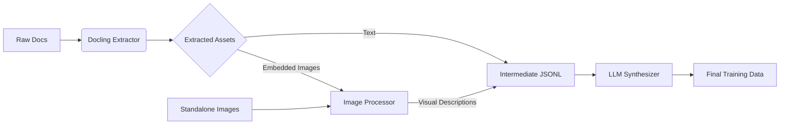

# CLaRa Data Pipeline & Training Guide

This guide documents the end-to-end data processing pipeline and training workflow for the CLaRa (Continuous Latent Reasoning) project. It is designed to run in a **hybrid environment**: data preparation on a local machine (macOS) and model training on a GPU cloud (Google Colab).

## 1. Architecture Overview

The pipeline transforms raw unstructured documents (PDF, Word, PPT, Images) into high-quality, bilingual (CN/EN) training data for the CLaRa model.



### Key Features
*   **Smart Extraction**: Uses **IBM Docling** for layout-aware PDF parsing and embedded image extraction.
*   **Visual Understanding**: Automatically describes images (charts, flowcharts) using Vision LLMs (Qwen-VL/GPT-4o).
*   **Bilingual Support**: Synthesizes Cross-Lingual QA pairs (e.g., English Query -> Chinese Doc) to enable mixed-language retrieval.
*   **Robustness**: Auto-skips corrupt images and supports resume (breakpoint continuation).

---

## 2. Local Environment (macOS) - Data Preparation

### Prerequisites
Create a dedicated environment to avoid conflicts (especially with Docling dependencies).

```bash
conda create -n clara_env python=3.10 -y
conda activate clara_env

# Install dependencies (Optimized for macOS)
pip install -r requirements.txt
```

### Configuration
Set your API keys. The pipeline supports OpenAI and Aliyun DashScope (Qwen).

```bash
# For Aliyun DashScope (Recommended for Qwen models)
export OPENAI_API_KEY="sk-..." 
export BASE_URL="https://dashscope.aliyuncs.com/compatible-mode/v1"
export VISION_MODEL="qwen-vl-max"   # For image description
export MODEL="qwen-turbo"           # For text synthesis (QA generation)
```

### Execution

Run the one-click pipeline script. This script handles cleaning, extraction, visual analysis, and synthesis.

```bash
bash scripts/run_data_pipeline.sh
```

**What happens under the hood:**
1.  **Cleanup**: Removes old assets in `example/extracted_assets` to ensure a clean slate.
2.  **Step 1 (Docling)**: Parses PDF/DOCX/PPTX. Text is saved to JSONL; embedded images are extracted to `extracted_assets/`.
3.  **Step 1.5 (Vision)**: 
    *   **Pass 1**: Scans `RAW_DATA_DIR` for standalone JPG/PNG files.
    *   **Pass 2**: Scans `extracted_assets/` for embedded images extracted in Step 1. 
    *   *Self-Healing*: Validates images with Pillow, converts to JPEG, and skips corrupt files automatically.
4.  **Step 2 (Synthesis)**: Uses the LLM (`$MODEL`) to generate Dense Summaries and Bilingual QA pairs (3-5 pairs per chunk).

### Output
*   **Final Data**: `example/clara_training_data.jsonl`
*   **Intermediate Data**: `example/raw_knowledge.jsonl` (Contains raw text + image descriptions)
*   **Asset Folder**: `example/extracted_assets/` (Extracted image files)

---

## 3. Cloud Environment (Google Colab) - Model Training

Since macOS lacks NVIDIA GPUs for efficient training, we migrate the processed data to Colab.

### Preparation
1.  **Pack Data**: Compress the project directory (excluding large/unnecessary files).
    ```bash
    # Run in project root
tar -czvf ml-clara-package.tar.gz \
        --exclude='.git' \
        --exclude='venv' \
        --exclude='__pycache__' \
        --exclude='extracted_assets' \
        .
    ```
2.  **Upload**: Upload `ml-clara-package.tar.gz` to your Google Drive.

### CLaRa 3-Stage Training Process (using `train_qwen3_clara.sh`)

CLaRa training is typically performed in three sequential stages. Our `scripts/train_qwen3_clara.sh` script is designed to run any of these stages by modifying the `STAGE` variable and loading the appropriate previous checkpoint.

**Base Model:** `Qwen/Qwen3-4B-Instruct-2507` (or your chosen base model)
**Training Data:** `./example/clara_training_data.jsonl` (generated from local pipeline)

#### Stage 1: Compression Pretraining (`STAGE="stage1"`)
*   **Goal**: Teach the language model to effectively *compress* documents into dense latent representations (memory tokens). It learns to map document content to these "thoughts" or "summaries".
*   **Setup**: Starts from the base Qwen3 Instruct model.
*   **Run Commands (Colab Cell):**
    ```bash
    # Ensure you are in /content/ml-clara
    %cd /content/ml-clara

    # Set initial MODEL_PATH to the base model
    export BASE_MODEL_PATH="Qwen/Qwen3-4B-Instruct-2507"
    export SAVE_DIR="./checkpoints/clara_qwen3_stage1"
    export STAGE="stage1" # Define the current stage

    # Create save directory
    mkdir -p $SAVE_DIR

    # Update the script variables for this run (optional, can also edit the script directly)
    sed -i "s|MODEL_PATH=\".*\"|MODEL_PATH=\"$BASE_MODEL_PATH\"|" scripts/train_qwen3_clara.sh
    sed -i "s|SAVE_PATH=\".*\"|SAVE_PATH=\"$SAVE_DIR\"|" scripts/train_qwen3_clara.sh
    sed -i "s|STAGE=\".*\"|STAGE=\"$STAGE\"|" scripts/train_qwen3_clara.sh
    sed -i "s|use_wandb \".*\"|use_wandb \"CLaRa-Qwen3-Stage1\"|" scripts/train_qwen3_clara.sh

    # Grant execute permission and run
    !chmod +x scripts/train_qwen3_clara.sh
    !bash scripts/train_qwen3_clara.sh
    ```

#### Stage 2: Instruction Tuning (`STAGE="stage2"`)
*   **Goal**: Teach the model to *answer questions* based on the compressed latent representations from Stage 1. It fine-tunes the generation capabilities.
*   **Setup**: Loads the model (and its LoRA adapters) saved from Stage 1.
*   **Run Commands (Colab Cell):**
    ```bash
    # Ensure you are in /content/ml-clara
    %cd /content/ml-clara

    # Load model from previous stage's output
    export PREV_STAGE_MODEL_PATH="./checkpoints/clara_qwen3_stage1" 
    export SAVE_DIR="./checkpoints/clara_qwen3_stage2"
    export STAGE="stage2" # Define the current stage

    # Create save directory
    mkdir -p $SAVE_DIR

    # Update the script variables for this run
    sed -i "s|MODEL_PATH=\".*\"|MODEL_PATH=\"$PREV_STAGE_MODEL_PATH\"|" scripts/train_qwen3_clara.sh
    sed -i "s|SAVE_PATH=\".*\"|SAVE_PATH=\"$SAVE_DIR\"|" scripts/train_qwen3_clara.sh
    sed -i "s|STAGE=\".*\"|STAGE=\"$STAGE\"|" scripts/train_qwen3_clara.sh
    sed -i "s|use_wandb \".*\"|use_wandb \"CLaRa-Qwen3-Stage2\"|" scripts/train_qwen3_clara.sh

    # Grant execute permission and run
    !chmod +x scripts/train_qwen3_clara.sh
    !bash scripts/train_qwen3_clara.sh
    ```

#### Stage 3: End-to-End Fine-tuning (`STAGE="e2e"` or `stage2_reasoning`)
*   **Goal**: Jointly fine-tune both the compression and generation components for optimal end-to-end performance. This often involves more complex loss functions and may require negative sampling.
*   **Setup**: Loads the model from Stage 2.
*   **Run Commands (Colab Cell):**
    ```bash
    # Ensure you are in /content/ml-clara
    %cd /content/ml-clara

    # Load model from previous stage's output
    export PREV_STAGE_MODEL_PATH="./checkpoints/clara_qwen3_stage2" 
    export SAVE_DIR="./checkpoints/clara_qwen3_e2e"
    export STAGE="e2e" # Define the current stage (or "stage2_reasoning" depending on specific needs)

    # Create save directory
    mkdir -p $SAVE_DIR

    # Update the script variables for this run
    sed -i "s|MODEL_PATH=\".*\"|MODEL_PATH=\"$PREV_STAGE_MODEL_PATH\"|" scripts/train_qwen3_clara.sh
    sed -i "s|SAVE_PATH=\".*\"|SAVE_PATH=\"$SAVE_DIR\"|" scripts/train_qwen3_clara.sh
    sed -i "s|STAGE=\".*\"|STAGE=\"$STAGE\"|" scripts/train_qwen3_clara.sh
    sed -i "s|use_wandb \".*\"|use_wandb \"CLaRa-Qwen3-E2E\"|" scripts/train_qwen3_clara.sh

    # Grant execute permission and run
    !chmod +x scripts/train_qwen3_clara.sh
    !bash scripts/train_qwen3_clara.sh
    ```

---

## 4. Troubleshooting

| Issue | Cause | Solution |
| :--- | :--- | :--- |
| **401 Authentication Fails** | Wrong API Key or Base URL | Check `export BASE_URL=...` matches your provider (e.g. DashScope). |
| **404 Model Not Found** | Using default `deepseek-chat` on Aliyun | Set `export MODEL="qwen-turbo"` in your environment. |
| **Image Format Illegal** | Corrupt PDF image extraction | The pipeline now auto-skips these. No action needed. |
| **OOM (Out of Memory)** | Colab GPU limit reached | Reduce `--per_device_train_batch_size` in `train_qwen3_clara.sh` to 1. |

## 5. Advanced Customization

*   **Prompt Engineering**: Modify `PROMPT_TEMPLATE` in `scripts/synthesize_data.py` to adjust how questions are generated (e.g., adding more reasoning tasks).
*   **Docling Config**: Edit `scripts/extract_with_docling.py` to change `pipeline_options.images_scale` if you need higher resolution image extraction.

```
